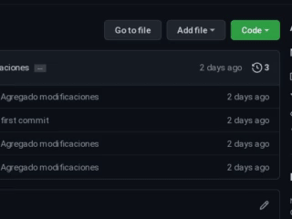

# Trayecto de Formación: FullStack Web Developer :rocket:

## Bienvenido a mi portfolio :wave:
Hola! :smile: gracias por visitar mi portfolio, me presento, soy Gustavo Alberto Ordoñez, futuro desarrollador fullstack y estudiante de la carrera Analista Programador Universitario de la Universidad Nacional de Jujuy Facultad de Ingeniería. En este pequeño proyecto conoceras algunos de mis trabajos y habilidades. También conoceras un poco más sobre mi. Espero la visita sea de su agrado.

## Instalación

Si tienes Git instalado puedes ejecutar el siguiente comando en tu bash:

``` bash
 $ git clone https://github.com/gus0117/portfolio-template.git
```

Sino, también puedes descargar el proyecto como un archivo zip



## Iniciar el proyecto

Puedes utilizar cualquier navegador o bien alguna extensión para VSCode como [Live Server](https://marketplace.visualstudio.com/items?itemName=ritwickdey.LiveServer).

## Manejo de problemas

Si tienes algún problema o duda, puedes enviarme un correo electrónico a gustavoalberto117@gmail.com y trataré de responderte a la brevedad.

## Recursos

Si te interesa saber más del avatar utilizado en este proyecto, puede ver [Open Peeps](https://www.openpeeps.com) donde podrás personalizar y descargar tu propio avatar con el mismo estilo y gratis.